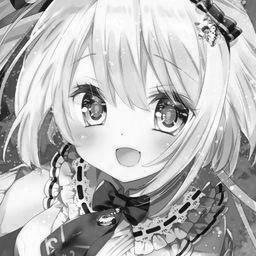
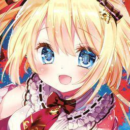
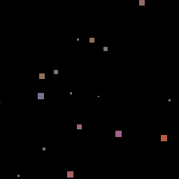

# Colorize Black & White Anime Arts with User's input colors

Colorize Black & White Anime Arts with user's input colors

**No Hint**

| Gray | Fake | Real |
| --- | --- | --- |
|  |  |  |

**Local Hint**

| Gray | Local Hint | Fake | Real |
| --- | --- | --- | --- |
|  |  |  |  |


## Environments and Dependencies

- Python 3.8.16

Install requirements

``` bash
pip install -r requirements.txt
```

## Data

Prepare a `./data/` directory contain all subfolder of images used for training in format

``` folder
data/
    |-- train/
    |   |-- class 1/
    |   |   |-- img 1
    |   |   |-- img 2
    |   |   `-- ...
    |   |-- class 2/
    |   |   |-- img 1
    |   |   |-- img 2
    |   |   `-- ...
    |   `-- ...
    |-- train_small/
    |   `-- small_set/
    |       |-- img 1
    |       |-- img 2
    |       `-- ...
    `-- val/
        `-- classname/
            |-- img 1
            |-- img 2
            `-- ...

```

## Easy Use

For easy use, simply download pretrained weight from [here](https://drive.google.com/file/d/1HrMR3Holk2TSKQUCbmYHCZL5rDqu2Iag/view?usp=share_link), modify config in `config.py` and run 

``` bash
python infer.py
```

## Training

You can update hyperparameter in `train.sh` and training a model from scratch using

``` bash
bash train.sh
```

## Valid

Update hyperparameter in `test.sh` and valid a model using

``` bash
bash test.sh
```

## TODO

- [ ] Add Global Hints

## Acknowledgments

This coding is heavily followed by [colorization-pytorch](https://github.com/richzhang/colorization-pytorch)'s repo.